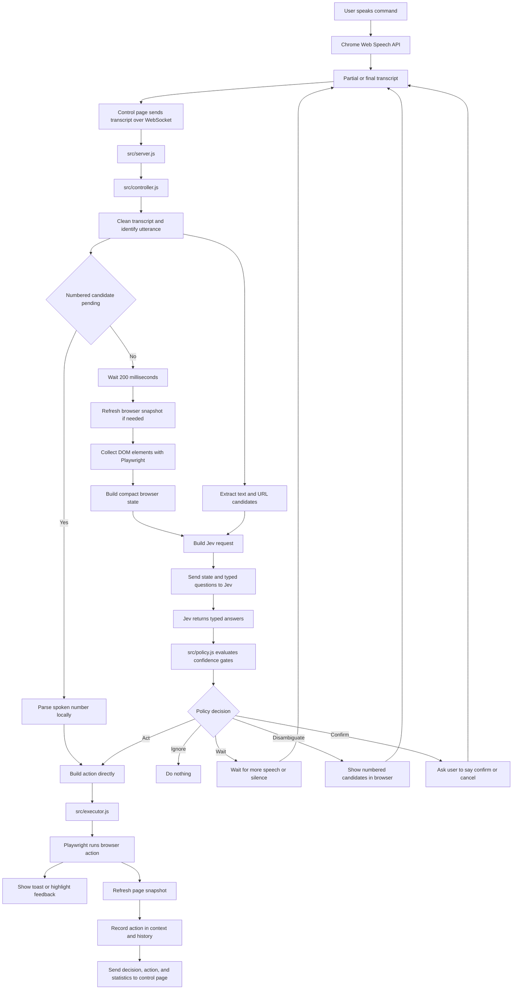

# Voice Input → Jev → Browser Action

This document explains how `jev-voice-browser` turns a spoken command into an action performed by a Playwright-controlled browser.

Repository: <https://github.com/moritzkremb/jev-voice-browser>

The example used throughout is:

> “Search for Alan Turing”

---

## 1. High-level flow



---

## 2. Detailed Alan Turing example

The user says:

> “Search for Alan Turing”

The system does not send only the raw sentence to Jev. It combines the transcript with the current browser state and a set of typed questions.

The flow is:

```text
Voice
  ↓
Transcript
  ↓
Candidate extraction
  ↓
Page snapshot
  ↓
Jev typed questions
  ↓
Jev typed answers
  ↓
Policy checks
  ↓
Concrete browser action
  ↓
Playwright execution
```

---

## 3. Step 1: The user speaks

The microphone is handled by the control page in:

```text
src/public/index.html
```

The control page uses the browser's Web Speech API. Speech recognition can produce partial results before the user finishes:

```text
search
search for
search for Alan
search for Alan Turing
```

The recognizer sends each result to the local server with information such as:

```json
{
  "type": "transcript",
  "text": "search for Alan Turing",
  "final": false,
  "utteranceId": "u0-0"
}
```

The `final` field indicates whether the speech recognizer believes the utterance is complete.

---

## 4. Step 2: The control page sends the transcript to Node

The control page sends the transcript over a WebSocket.

```text
Control page
    |
    | { type: "transcript", text, final, utteranceId }
    v
src/server.js
```

`src/server.js` forwards the transcript to the controller:

```javascript
controller.handleTranscript({
  text: msg.text,
  final: Boolean(msg.final),
  utteranceId: msg.utteranceId
});
```

The TypeSafe API key remains on the server. It is not sent to the control page.

---

## 5. Step 3: `Controller` cleans and debounces the transcript

`src/controller.js` is the main orchestrator.

It:

- Cleans up whitespace
- Tracks the current utterance
- Prevents one utterance from executing repeatedly
- Supports commands spoken in one breath
- Waits approximately 200 ms after a transcript update
- Cancels stale Jev requests when newer transcript text arrives

For the Alan Turing example, the controller may see:

```text
search
search for
search for Alan
search for Alan Turing
```

The 200 ms debounce prevents the system from unnecessarily sending a request for every intermediate update.

Free-text commands such as searches also have an additional completion rule. The policy waits for either:

- The recognizer's final result, or
- Approximately 600 ms of silence

This prevents the browser from searching for `Alan` while the user is still saying `Turing`.

---

## 6. Step 4: The controller obtains the current browser snapshot

Before asking Jev what the command means, the system needs the current state of the controlled browser.

The controlled browser is managed by Playwright through:

```text
src/browser.js
src/snapshot.js
```

The snapshot includes:

```json
{
  "url": "https://en.wikipedia.org/wiki/Main_Page",
  "title": "Wikipedia, the free encyclopedia",
  "site": "wikipedia",
  "searchBoxId": "e02",
  "elements": [
    {
      "id": "e01",
      "role": "link",
      "text": "Main page"
    },
    {
      "id": "e02",
      "role": "searchbox",
      "placeholder": "Search Wikipedia"
    }
  ]
}
```

The actual state sent to Jev is compacted into human-readable element lines such as:

```text
e01 link "Main page"
e02 searchbox (placeholder: Search Wikipedia)
e03 link "Featured article"
```

The snapshot is deliberately limited:

- Interactive elements are collected from the page
- Visible elements are prioritized
- Duplicate elements are removed
- Text is truncated
- The list is capped
- The total state size is bounded

The goal is to give Jev enough information to identify targets without sending the entire HTML document.

---

## 7. Step 5: Code extracts text candidates

This is handled by:

```text
src/spans.js
```

For:

```text
search for Alan Turing
```

the code uses structured patterns, not every possible combination of words.

It looks for:

- Quoted text
- Text following `search for`
- Text following `look up`
- Text following `google`
- Text following `find`
- Text following `type`
- Text following `enter`
- Text following `write`
- Text following `fill`
- Text after the word `for`
- A fallback consisting of text after the first word
- The complete transcript as a final fallback

Possible candidates may include:

```json
[
  "Alan Turing",
  "for Alan Turing",
  "search for Alan Turing"
]
```

The desired candidate is:

```text
Alan Turing
```

The code also:

- Removes filler words such as `please` and `okay`
- Removes duplicates
- Rejects candidates longer than 120 characters
- Limits the candidate list to eight entries

It does **not** generate every substring:

```text
Alan
Turing
Alan Turing
for Alan
for Alan Turing
...
```

Instead, it generates a small number of candidates based on recognized command structure.

---

## 8. Step 6: Code extracts URL candidates

URLs are handled separately.

Spoken URL phrases are normalized first:

```text
example dot com
```

becomes:

```text
example.com
```

The code then searches for domain-like patterns.

Examples:

```text
go to example dot com
```

produces:

```json
["example.com"]
```

```text
visit https://docs.typesafe.ai/models
```

produces:

```json
["https://docs.typesafe.ai/models"]
```

For the Alan Turing example, there may be no URL candidates, so no `url_span` question is added to the request.

---

## 9. Step 7: `jev.js` builds the request

`src/jev.js` combines the following:

1. The transcript
2. The current page information
3. The compact interactive-element list
4. Candidate text spans
5. Candidate URL spans, if any
6. Recent actions
7. Previous-page context
8. Tab information
9. Any pending confirmation

For the example, the state might look like:

```json
{
  "transcript": "search for Alan Turing",
  "page": {
    "url": "https://en.wikipedia.org/wiki/Main_Page",
    "title": "Wikipedia, the free encyclopedia",
    "site": "wikipedia"
  },
  "elements": [
    "e01 link \"Main page\"",
    "e02 searchbox (placeholder: Search Wikipedia)",
    "e03 link \"Featured article\""
  ]
}
```

The code also creates a candidate option map:

```json
{
  "Alan Turing": null,
  "for Alan Turing": null,
  "search for Alan Turing": null,
  "none": "Nothing should be typed or searched"
}
```

The `null` values represent selectable options. The `none` option gives Jev an explicit way to say that no candidate should be used.

---

## 10. Step 8: Jev receives several typed questions

Jev is not asked one general question such as:

> “What should the browser do?”

Instead, it receives multiple typed questions in one request.

Typical questions include:

| Question | Purpose |
|---|---|
| `intent` | Is this a search, click, navigation, scroll, typing action, etc.? |
| `target` | Which page element is being referred to? |
| `site` | Which website or search engine is named? |
| `complete` | Has the user finished the command? |
| `is_command` | Is the user talking to the browser? |
| `destructive` | Would the action cause a risky side effect? |
| `scroll_amount` | How far should the page scroll? |
| `text_span` | Which extracted candidate is the text to search or type? |
| `url_span` | Which extracted candidate is the URL? |
| `tab_direction` | Which tab direction is intended? |
| `is_correction` | Is the user correcting a previous action? |

For the Alan Turing example, the important questions are:

```text
Which browser action does the user ask for in `transcript`?
```

and:

```text
Which option is exactly the text the user wants typed or searched,
as spoken in `transcript`?
```

The text-span question includes this guidance:

```text
Choose the span that contains the payload text only,
without the command words (type, search for, into the search box).
Pick none if nothing should be typed.
```

This is defined in `src/constants.js`.

---

## 11. Potential application-level Jev request

The actual request is assembled through the TypeSafe SDK:

```javascript
client.systemOne(
  {
    state,
    questions,
    model: MODEL
  },
  { signal }
);
```

The exact wire-level JSON is determined by `@typesafe-ai/sdk`. However, a representative application-level request could look like this:

```json
{
  "model": "jev-1.13.0",
  "state": {
    "transcript": "search for Alan Turing",
    "page": {
      "url": "https://en.wikipedia.org/wiki/Main_Page",
      "title": "Wikipedia, the free encyclopedia",
      "site": "wikipedia"
    },
    "elements": [
      "e01 link \"Main page\"",
      "e02 searchbox (placeholder: Search Wikipedia)",
      "e03 link \"Featured article\""
    ]
  },
  "questions": {
    "intent": {
      "type": "choice",
      "instructions": {
        "question": "Which browser action does the user ask for in `transcript`?",
        "focus": "Judge the words said so far. If the sentence is unfinished, pick the action the words already commit to; if no action is recognizable pick none."
      },
      "criteria": {
        "navigate_url": {
          "what": "Open a specific website or URL by name",
          "not_for": "Searching for a topic; clicking something already on the page",
          "examples": [
            "go to wikipedia",
            "open youtube"
          ]
        },
        "search_web": {
          "what": "Search for a topic or phrase",
          "not_for": "Typing into a specific named field without searching",
          "examples": [
            "search for alan turing",
            "look up typesafe jev"
          ]
        },
        "click_element": {
          "what": "Click or open an element on the current page",
          "not_for": "Opening a website by name; typing text",
          "examples": [
            "click the first result",
            "click sign in"
          ]
        },
        "none": {
          "what": "Not a browser command",
          "examples": [
            "I think we should get lunch"
          ]
        }
      }
    },
    "target": {
      "type": "choice",
      "instructions": {
        "question": "Which element in `elements` is the one the user refers to in `transcript`?"
      },
      "criteria": {
        "e01": null,
        "e02": null,
        "e03": null,
        "none": "No element on this page is referred to"
      }
    },
    "site": {
      "type": "choice",
      "instructions": {
        "question": "Which website or search engine does the user name in `transcript`?"
      },
      "criteria": {
        "wikipedia": "Wikipedia, the encyclopedia",
        "the_web": "A general web search with no site named",
        "none": "No website or search engine is mentioned in `transcript`"
      }
    },
    "complete": {
      "type": "noul",
      "instructions": {
        "question": "Has the user finished saying the command, so it can be executed now?"
      }
    },
    "is_command": {
      "type": "noul",
      "instructions": {
        "question": "Is `transcript` an instruction addressed to a web browser?"
      }
    },
    "destructive": {
      "type": "noul",
      "instructions": {
        "question": "Would carrying out the action submit, buy, pay, delete, send, post, or otherwise cause an irreversible side effect?"
      }
    },
    "scroll_amount": {
      "type": "score",
      "instructions": {
        "question": "How far does the user want to scroll?"
      }
    },
    "tab_direction": {
      "type": "choice",
      "instructions": {
        "question": "When switching tabs, which tab does the transcript refer to?"
      }
    },
    "text_span": {
      "type": "choice",
      "instructions": {
        "question": "Which option is exactly the text the user wants typed or searched, as spoken in `transcript`?",
        "focus": "Choose the span that contains the payload text only, without the command words."
      },
      "criteria": {
        "Alan Turing": null,
        "for Alan Turing": null,
        "search for Alan Turing": null,
        "none": "Nothing should be typed or searched"
      }
    }
  }
}
```

The request is dynamic:

- `target.criteria` is based on the current page elements
- `text_span.criteria` is added only when text candidates exist
- `url_span.criteria` is added only when URL candidates exist
- `is_correction` is added only when previous actions exist

---

## 12. Step 9: Jev returns typed answers

Jev may return an answer structure like:

```json
{
  "answers": {
    "intent": {
      "choice": "search_web",
      "confidence": 0.98,
      "probabilities": {
        "search_web": 0.98,
        "navigate_url": 0.01,
        "click_element": 0.005,
        "none": 0.005
      }
    },
    "target": {
      "choice": "none",
      "confidence": 0.99,
      "probabilities": {
        "none": 0.99,
        "e01": 0.003,
        "e02": 0.003,
        "e03": 0.004
      }
    },
    "site": {
      "choice": "none",
      "confidence": 0.92,
      "probabilities": {
        "none": 0.92,
        "wikipedia": 0.06,
        "the_web": 0.02
      }
    },
    "complete": {
      "noul": 0.97
    },
    "is_command": {
      "noul": 0.99
    },
    "destructive": {
      "noul": 0.01
    },
    "scroll_amount": {
      "score": 1,
      "confidence": 0.8
    },
    "tab_direction": {
      "choice": "none",
      "confidence": 0.99
    },
    "text_span": {
      "choice": "Alan Turing",
      "confidence": 0.96,
      "probabilities": {
        "Alan Turing": 0.96,
        "for Alan Turing": 0.02,
        "search for Alan Turing": 0.01,
        "none": 0.01
      }
    }
  }
}
```

The important result is:

```json
{
  "text_span": {
    "choice": "Alan Turing",
    "confidence": 0.96
  }
}
```

Jev selected one of the candidates. It did not generate new text.

The response also includes metadata such as:

```json
{
  "latencyMs": 310,
  "usage": {
    "input_tokens": 4200
  },
  "model": "jev-1.13.0",
  "requestId": "..."
}
```

---

## 13. Step 10: `policy.js` validates the result

Jev's response is passed to:

```text
src/policy.js
```

The policy applies deterministic thresholds defined in:

```text
src/constants.js
```

Typical thresholds include:

```text
is_command       >= 0.50
intent confidence >= 0.55
complete         >= 0.60
target confidence >= 0.45
target probability >= 0.35
destructive      >= 0.50 requires confirmation
```

For the Alan Turing example:

```text
is_command = 0.99       pass
intent = search_web      pass
intent confidence = .98 pass
complete = 0.97         pass
text_span confidence = .96 pass
destructive = 0.01      safe
```

The policy produces a concrete action.

If the page is Wikipedia and has a detected search box, the action may be:

```json
{
  "decision": "act",
  "action": {
    "type": "type_into_field",
    "targetId": "e02",
    "text": "Alan Turing",
    "submit": true,
    "label": "search this site: Alan Turing"
  }
}
```

The selected text is copied verbatim from the candidate list.

If there is no usable search box, the policy may instead create a search URL:

```json
{
  "decision": "act",
  "action": {
    "type": "navigate_url",
    "url": "https://duckduckgo.com/?q=Alan%20Turing",
    "query": "Alan Turing",
    "label": "search: Alan Turing"
  }
}
```

The code owns the URL template. Jev only selected the query.

---

## 14. Step 11: Playwright executes the action

The action goes to:

```text
src/executor.js
```

For the action:

```json
{
  "type": "type_into_field",
  "targetId": "e02",
  "text": "Alan Turing",
  "submit": true
}
```

the executor:

1. Finds the element using its generated ID
2. Highlights the field
3. Displays a toast
4. Focuses the field
5. Clears it
6. Types `Alan Turing`
7. Presses Enter
8. Waits for the page to settle

The locator is based on the `data-vb-id` added during page scanning:

```javascript
page.locator('[data-vb-id="e02"]').first()
```

Conceptually:

```text
Jev/code selects e02
        ↓
Playwright finds [data-vb-id="e02"]
        ↓
Playwright types "Alan Turing"
        ↓
Playwright presses Enter
```

Jev does not access the DOM or call Playwright. It only returns typed classifications and selections.

---

## 15. Step 12: The controller records and refreshes state

After Playwright finishes, the controller:

1. Records whether the action succeeded
2. Records the resulting URL or page state
3. Adds the action to recent context
4. Refreshes the browser snapshot
5. Sends updated decision and action data to the control page

This gives future commands context, for example:

```text
“Go back to the results”
“Open the documentation”
“No, the other one”
```

The next Jev request includes recent actions and, when appropriate, the previous page.

---

# Numbered candidates

## What they are

Numbered candidates are a clarification mechanism for **ambiguous browser elements**.

They are different from text candidates such as:

```text
Alan Turing
```

Numbered candidates are page elements that Jev thinks might be the user's intended target.

For example, the page might contain:

```text
Documentation
Pricing
Read the docs
```

The user says:

> “Click the link”

The intent is clear: `click_element`.

The target is not clear enough. Jev may assign probabilities like:

```json
{
  "target": {
    "choice": "e03",
    "confidence": 0.32,
    "probabilities": {
      "e03": 0.32,
      "e07": 0.28,
      "e04": 0.20,
      "none": 0.20
    }
  }
}
```

The target confidence is below the required threshold, so the policy does not click automatically.

Instead, it returns:

```json
{
  "decision": "disambiguate",
  "candidates": [
    {
      "id": "e03",
      "label": "link \"Documentation\"",
      "p": 0.32
    },
    {
      "id": "e07",
      "label": "link \"Read the docs\"",
      "p": 0.28
    },
    {
      "id": "e04",
      "label": "link \"Pricing\"",
      "p": 0.20
    }
  ],
  "pendingIntent": {
    "type": "click_element"
  }
}
```

## What the user sees

The controlled page displays overlays:

```text
① Documentation
② Read the docs
③ Pricing
```

It also displays a toast:

```text
Which one? Say the number.
```

The overlay uses the original element IDs to draw blue outlines and numbered badges around the possible targets.

## What happens when the user says “two”

The controller sees that numbered candidates are pending and parses the response locally:

```text
“two”          → 2
“the second”   → 2
“number 3”     → 3
“click the first one” → 1
```

If the second candidate is:

```json
{
  "id": "e07",
  "label": "link \"Read the docs\""
}
```

the controller builds:

```json
{
  "type": "click_element",
  "targetId": "e07",
  "label": "link \"Read the docs\""
}
```

This goes directly to Playwright.

There is no new Jev call for the number because the clarification is deterministic.

## Numbered-candidate flow

```text
User: “Click the link”
        ↓
Jev identifies click intent
        ↓
Jev finds multiple plausible target elements
        ↓
Policy returns DISAMBIGUATE
        ↓
Browser displays ① ② ③
        ↓
User: “Two”
        ↓
Code maps 2 to the second element ID
        ↓
Playwright clicks that element
```

## Important distinction

There are two meanings of “candidate”:

### Text or URL candidates

Possible payloads extracted from speech:

```text
search for Alan Turing
        ↓
Alan Turing
for Alan Turing
search for Alan Turing
```

Jev selects one using `text_span`.

### Numbered element candidates

Possible DOM targets on the current page:

```text
① Documentation
② Read the docs
③ Pricing
```

Jev ranks these using `target`. If the ranking is ambiguous, the user chooses one by number.

---

# Text-candidate questions in more detail

## Why candidate extraction happens before Jev

The application intentionally does not ask Jev to invent arbitrary search text, URLs, or typed content.

Instead:

```text
Code proposes possible spans.
Jev selects the best span.
Policy validates the selection.
Code copies the selected value verbatim.
```

This reduces the risk of:

- Jev changing the user's wording
- Jev inventing text
- Jev producing an unintended URL
- A generated value being typed or submitted automatically

## The `text_span` question

The text-span question is:

```text
Which option is exactly the text the user wants typed or searched,
as spoken in `transcript`?
```

Its guidance says:

```text
Choose the span that contains the payload text only,
without the command words (type, search for, into the search box).
Pick none if nothing should be typed.
```

The candidates become the options in a `Choice` question:

```json
{
  "text_span": {
    "type": "choice",
    "criteria": {
      "Alan Turing": null,
      "for Alan Turing": null,
      "search for Alan Turing": null,
      "none": "Nothing should be typed or searched"
    }
  }
}
```

A possible answer is:

```json
{
  "choice": "Alan Turing",
  "confidence": 0.96,
  "probabilities": {
    "Alan Turing": 0.96,
    "for Alan Turing": 0.02,
    "search for Alan Turing": 0.01,
    "none": 0.01
  }
}
```

## The `url_span` question

The URL-span question is:

```text
Which option is the web address (domain) the user wants to open,
as spoken in `transcript`?
```

For:

```text
go to example dot com
```

the options might be:

```json
{
  "url_span": {
    "type": "choice",
    "criteria": {
      "example.com": null,
      "none": "No web address is mentioned"
    }
  }
}
```

A possible answer is:

```json
{
  "choice": "example.com",
  "confidence": 0.98,
  "probabilities": {
    "example.com": 0.98,
    "none": 0.02
  }
}
```

The code then converts the selected domain to:

```text
https://example.com
```

before Playwright navigates.

## What happens with low confidence

The configured minimum confidence for text and URL spans is:

```text
T.spanConfidence = 0.35
```

If Jev selects a candidate below that confidence, the policy can fall back to the first heuristic candidate:

```javascript
function pickSpan(answer, minConfidence, fallback) {
  if (!answer) return fallback ?? null;
  if (answer.choice === "none") return null;
  if (answer.confidence < minConfidence) {
    return fallback ?? answer.choice;
  }
  return answer.choice;
}
```

This still does not create new text. The fallback must come from the candidates already extracted by code.

## Text-candidate responsibility split

```text
src/spans.js
  Extract possible text and URL spans from the transcript

src/jev.js
  Put those spans into typed Choice questions

Jev
  Select one candidate and return probabilities

src/policy.js
  Validate the selected candidate's confidence

src/executor.js
  Type or navigate using the selected value
```

---

# Final simple flow

```text
Voice
  → transcript
  → WebSocket
  → Controller
  → Playwright page snapshot
  → transcript + page state + typed questions
  → Jev probabilities and selections
  → deterministic policy
  → concrete action object
  → Playwright browser operation
  → refreshed page state
```

For the Alan Turing example:

```text
“Search for Alan Turing”
  → Web Speech API transcript
  → controller receives transcript
  → code extracts “Alan Turing” as a candidate
  → Playwright supplies the current page and search-box snapshot
  → Jev selects:
      intent = search_web
      text_span = “Alan Turing”
      complete = true
      is_command = true
  → policy creates:
      type_into_field(e02, “Alan Turing”, submit=true)
  → Playwright finds e02
  → Playwright types “Alan Turing”
  → Playwright presses Enter
  → controller refreshes the page snapshot
```
````
