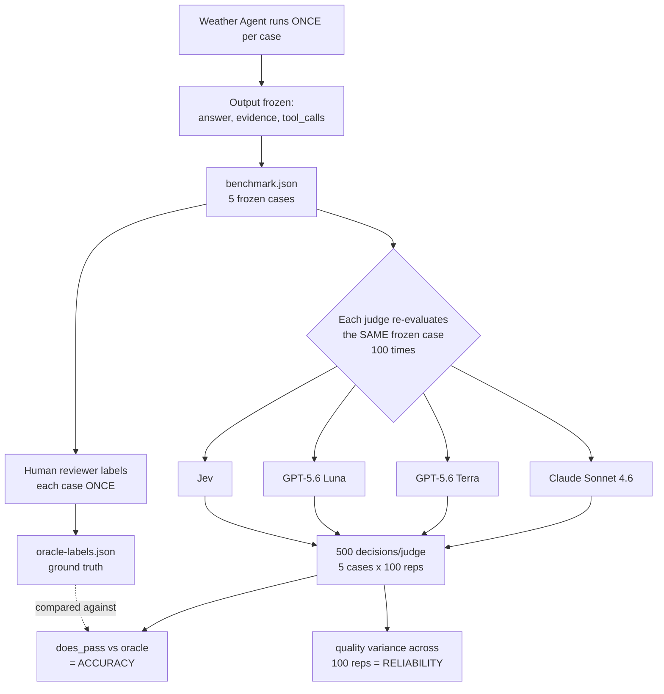
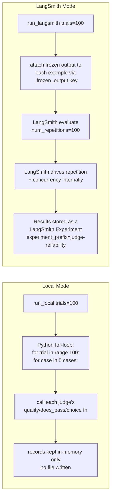

# LLM-as-a-Judge, LangSmith, and Jev — Reference Notes

Source repo studied: [`danielgshea/jev-as-a-judge`](https://github.com/danielgshea/jev-as-a-judge)
Companion reading: [LangChain blog — "Building a harness with Jev"](https://www.langchain.com/blog/building-a-harness-with-jev)

## Table of Contents
1. [Overview](#1-overview)
2. [The Experiment Being Studied](#2-the-experiment-being-studied)
3. [LLM-as-a-Judge](#3-llm-as-a-judge)
4. [LangSmith's Role](#4-langsmiths-role)
5. [Jev / TypeSafe AI](#5-jev--typesafe-ai)
6. [LLM Judge vs. Jev — Side-by-Side](#6-llm-judge-vs-jev--side-by-side)
7. [References](#7-references)

---

## 1. Overview

This note captures a walkthrough of a repo that benchmarks **Jev** (a new non-generative "decision model" from TypeSafe AI) against three **LLM-as-judge** setups (GPT-5.6 Luna, GPT-5.6 Terra, Claude Sonnet 4.6), using **LangSmith** as the dataset/tracing/experiment backbone. The goal of the repo is to explore "a third option" beyond deterministic code and LLM judges for evaluating AI agent outputs.

Three things to come away with:
- **LLM-as-judge**: use a second model to score/pass-fail an agent's output instead of hand-coded assertions — but it inherits LLM weaknesses (variance, cost, latency).
- **LangSmith**: provides dataset storage, execution tracing, a model gateway, and experiment tracking/repetition tooling used to run this whole benchmark.
- **Jev**: a fundamentally different mechanism — no text generation at all. It takes a state + typed questions and returns typed probabilities directly.

---

## 2. The Experiment Being Studied

### 2.1 The weather agent
Built with **Deep Agents** + **Tavily** search. Model is configurable via `WEATHER_AGENT_MODEL` env var, defaulting to:
```python
model=os.getenv("WEATHER_AGENT_MODEL", "openai:gpt-5.5")
```
(`src/weather_agent/agent.py`). System prompt instructs it to always search for current/forecast data and never invent weather details.

### 2.2 The five test cases
| Location | Category |
|---|---|
| Seattle | current_conditions |
| Austin | multi_day_forecast (weekend) |
| Dublin | decision support ("need an umbrella?") |
| Tokyo | extended_forecast |
| Springfield | ambiguous_location |

### 2.3 Pipeline: one agent run → frozen output → human oracle → repeated judging



Key design point: freezing the agent output means **all variation from that point on comes from the judge**, not the agent. This isolates judge consistency/calibration as the variable under study — it is explicitly *not* a study of agent quality or of human-rater robustness (single rater, n=5 cases).

### 2.4 Frozen artifacts and their join key

- `assets/benchmark-jev-luna-terra-sonnet/<experiment-id>/benchmark.json` — 5 `frozen_cases`, each:
  ```json
  {
    "inputs": { "question": "..." },
    "metadata": { "category": "...", "dataset_split": ["base"] },
    "outputs": { "answer": "...", "evidence": [...], "tool_calls": [...] },
    "reference_outputs": { "location": "...", "search_required": true }
  }
  ```
- `oracle-labels.json` — 5 entries under `"labels"`, each with `is_grounded`, `matches_search_expectation`, `is_useful`, `does_pass` (0/1) + a `reasoning` object explaining each.
- **Join key**: literal `question` text string — no shared numeric/UUID case ID between the two files.

Example real case (Seattle):
- Question: *"What is the weather in Seattle today?"*
- Answer: "Partly cloudy, 62°F (feels like 60°F), ~9% chance of rain, humidity 70%, wind SSW 5 mph... Source: WeatherAPI"
- `tool_calls`: `["search_weather"]`
- `reference_outputs`: `{"location": "Seattle", "search_required": true}`

---

## 3. LLM-as-a-Judge

### 3.1 The shared input: `judge_state()`

Both LLM judges and Jev consume the **identical** state, built by `judge_state(inputs, outputs, reference_outputs)` in `src/evals/judges/__init__.py`:
```json
{
  "user_question": "...",
  "expected_behavior": {...},
  "final_answer": "...",
  "tool_calls": [...],
  "search_evidence": [...]
}
```

### 3.2 From free text to a typed Pydantic object

The LLM is still autoregressive — it generates text token by token. Structure is enforced via:
```python
llm.with_structured_output(LLMQualityResult, method="json_schema")
```
This converts the Pydantic schema into a **JSON Schema** and passes it to the provider as `response_format={"type": "json_schema", "json_schema": {...}, "strict": true}`. Under `strict: true`, the provider applies **constrained decoding**: at each generation step, only tokens that keep the output a valid instance of the schema are allowed. This is a hard structural guarantee, not a "hope it formats correctly" convention — and it is a different LangChain strategy from `method="function_calling"` (which instead frames the schema as a callable tool).

Schemas used (`src/evals/judges/llm.py`):
```python
class LLMQualityResult(BaseModel):
    is_grounded: float
    matches_search_expectation: float
    is_useful: float

class LLMDoesPassResult(BaseModel):
    does_pass: Literal[0, 1]

class LLMChoiceResult(BaseModel):
    choice: Literal["answered", "clarification_needed", "poor"]
```

Instructions text combined with `json.dumps(state)` via `_llm_prompt(state, instructions)`:
- **Quality**: "Score each statement from 0 to 1. Grounded means the answer is supported by the supplied search evidence. Search expectation means the agent searched for an unambiguous location and did not search an ambiguous one. Useful means it answers the requested weather question with the location, timing, details, and source links, or asks for clarification when appropriate."
- **Does-pass**: "Return exactly 1 if the final answer passes and 0 if it fails."
- **Choice**: "Classify the final response as exactly one of these outcomes: answered / clarification_needed / poor" (with descriptions per option).

### 3.3 Worked example — GPT Luna, Seattle case, `quality`

Model config (`src/evals/model.py`):
```python
GATEWAY_BASE_URL = "https://gateway.smith.langchain.com/v1"
LLM_JUDGES = {
  "gpt_luna":     ModelConfig("GPT-5.6 Luna",     "openai/gpt-5.6-luna",       "LANGSMITH_API_KEY"),
  "gpt_terra":    ModelConfig("GPT-5.6 Terra",    "openai/gpt-5.6-terra",      "LANGSMITH_API_KEY"),
  "claude_sonnet":ModelConfig("Claude Sonnet 4.6","anthropic/claude-sonnet-4-6","LS_LLM_GATEWAY_KEY"),
}
# ChatOpenAI(model=..., base_url=GATEWAY_BASE_URL, api_key=os.environ[api_key_env], timeout=180, max_retries=2)
```

**Request** (illustrative — actual OpenAI-compatible chat completions shape via the LangSmith gateway):
```http
POST https://gateway.smith.langchain.com/v1/chat/completions
Authorization: Bearer $LANGSMITH_API_KEY
```
```json
{
  "model": "openai/gpt-5.6-luna",
  "messages": [
    { "role": "user", "content": "Score each statement from 0 to 1. Grounded means... \n\nEvaluate this JSON state:\n{...Seattle state...}" }
  ],
  "response_format": {
    "type": "json_schema",
    "json_schema": {
      "name": "LLMQualityResult",
      "strict": true,
      "schema": {
        "type": "object",
        "properties": {
          "is_grounded": { "type": "number" },
          "matches_search_expectation": { "type": "number" },
          "is_useful": { "type": "number" }
        },
        "required": ["is_grounded", "matches_search_expectation", "is_useful"],
        "additionalProperties": false
      }
    }
  }
}
```

**Response** (`choices[0].message.content`, illustrative values):
```json
{ "is_grounded": 0.95, "matches_search_expectation": 1.0, "is_useful": 0.9 }
```

**Parsed + evaluator output**:
```python
LLMQualityResult(is_grounded=0.95, matches_search_expectation=1.0, is_useful=0.9)
```
```json
{ "key": "gpt_luna_weather_quality", "score": 0.9167, "comment": "is_grounded=0.950, matches_search_expectation=1.000, is_useful=0.900" }
```

`does_pass` for the same case is a **separate call** with its own schema:
- Response: `{"does_pass": 1}` → stored as `{"key": "gpt_luna_weather_does_pass", "score": 1, "comment": ""}`

> ⚠️ Note: the specific numeric values above (0.95, 1.0, 0.9, etc.) are illustrative, constructed for this walkthrough — not pulled from a stored per-repetition log in the repo. The repo's `benchmark.json` only contains frozen *agent* case data plus **aggregate** `analysis`/`summary`/`comparison` statistics, not raw per-repetition judge outputs.

### 3.4 Code map — LLM judge path

| File | Role |
|---|---|
| `src/evals/model.py` | `ModelConfig`, `LLM_JUDGES` dict, `create_chat_model()` — builds `ChatOpenAI` via LangSmith gateway |
| `src/evals/judges/llm.py` | Pydantic schemas, `_llm_prompt()`, `_build_evaluators(prefix, config)` (the `with_structured_output().invoke()` calls), `LLM_EVALUATORS` registry |
| `src/evals/judges/__init__.py` | `judge_state()`, choice-criteria descriptions, wires LLM + Jev evaluators together |

---

## 4. LangSmith's Role

- **Dataset storage** — 5 cases in a LangSmith dataset (`src/evals/dataset.py` → `EXAMPLES`)
- **Tracing** — every evaluator function decorated `@traceable(name=f"{prefix}_weather_...")`, auto-logging inputs/outputs when `LANGSMITH_TRACING=true`
- **Gateway** — `https://gateway.smith.langchain.com/v1`, routes all LLM-judge calls (and lets multiple providers share one uniform client interface)
- **Experiments** — `offline_evals.py` uploads the dataset and records an experiment; `judge_reliability.py` runs the repeated-judge benchmark, published as experiment `judge-reliability-db3ad610` (id `6d08df72-c878-458c-b7c5-a7824ee6e721`, started `2026-09-18T17:53:25Z`)

### Two execution modes in `judge_reliability.py`



- `JUDGES = ("jev", "gpt_luna", "gpt_terra", "claude_sonnet")`
- Local mode: quick, no LangSmith upload, everything in memory, printed to stdout via `_summarize()`.
- LangSmith mode: `evaluate(_frozen_target, data=examples, evaluators=[...], num_repetitions=trials, experiment_prefix="judge-reliability")` — LangSmith itself handles the 100x repetition and concurrency, and the result becomes the durable "reference" used for later accuracy/variance analysis.

---

## 5. Jev / TypeSafe AI

### 5.1 Concept

Jev is TypeSafe AI's **"System One" decision model** — explicitly *not* an autoregressive text generator. It takes a **state** (context) + **typed questions**, and returns **typed answers with probabilities**, in one request, all questions evaluated in parallel (extra questions ≈ free in latency/cost).

Claimed advantages (per the LangChain blog): up to 200x faster inference, 400x lower cost vs. LLMs on classification-style tasks. Trained via **RLCD** (reinforcement learning for calibrated decisions).

### 5.2 The three primitives

| Type | Purpose | Response fields |
|---|---|---|
| `Noul` | Yes/no probability question | `noul` (0–1) |
| `Score` | Rate against ordered rubric levels | `score`, `probabilities`, `confidence` |
| `Choice` | Pick among named options | `choice`, `probabilities`, `confidence` |

### 5.3 Real REST API shape (from `docs.typesafe.ai/api.md`)

```
POST https://api.typesafe.ai/v1/systemone
Authorization: Bearer <TYPESAFE_API_KEY>
Content-Type: application/json
```

Request top level: `state` (string|object|array), `model`, `questions` (map name → question spec).
Response top level: `model`, `answers` (map name → typed answer), `usage` (`input_tokens`, `output_tokens`).

Errors: `401 Unauthorized`, `422 Unprocessable Entity`, `429 Too Many Requests`, `529 Overloaded`.

Docs example (Noul, verbatim from TypeSafe docs):
```json
{
  "state": "Help! My payouts have been failing for 3 days.",
  "model": "jev-latest",
  "questions": {
    "is_urgent": {
      "type": "noul",
      "instructions": "Does this convey urgency?",
      "criteria": { "true": "Explicitly time-sensitive", "false": "No urgency expressed" }
    }
  }
}
```
```json
{
  "model": "jev-1.13.0",
  "answers": { "is_urgent": { "type": "noul", "noul": 0.95 } },
  "usage": { "input_tokens": 307, "output_tokens": 20 }
}
```

### 5.4 Worked example — Jev, Seattle case

**`does_pass` (single `Noul`)**
```python
DOES_PASS_QUESTIONS = { "does_pass": Noul(instructions="Does the final answer pass?") }
classifier = TypeSafeClassifier(questions=DOES_PASS_QUESTIONS)
answer = classifier.invoke(state)
```
Request:
```json
{
  "state": { "user_question": "What is the weather in Seattle today?", "...": "..." },
  "model": "jev-latest",
  "questions": { "does_pass": { "type": "noul", "instructions": "Does the final answer pass?" } }
}
```
Response:
```json
{
  "model": "jev-1.13.0",
  "answers": { "does_pass": { "type": "noul", "noul": 0.97 } },
  "usage": { "input_tokens": 214, "output_tokens": 6 }
}
```
Post-processing (`src/evals/judges/system_one.py`):
```python
probability = answer.nouls["does_pass"].noul
{ "key": "jev_weather_does_pass", "score": int(probability >= 0.5), "comment": f"probability={probability:.3f}" }
# -> {"key": "jev_weather_does_pass", "score": 1, "comment": "probability=0.970"}
```

**`quality` (three `Noul` questions, one call, parallel)**
```json
{
  "state": { "...same Seattle state..." },
  "model": "jev-latest",
  "questions": {
    "is_grounded": { "type": "noul", "instructions": "Is the final answer grounded in the supplied search evidence?" },
    "matches_search_expectation": { "type": "noul", "instructions": "Did the agent search for an unambiguous location and avoid searching an ambiguous one, as expected?" },
    "is_useful": { "type": "noul", "instructions": "Does the final answer usefully address the question with location, timing, and details, or ask for clarification when appropriate?" }
  }
}
```
```json
{
  "model": "jev-1.13.0",
  "answers": {
    "is_grounded": { "type": "noul", "noul": 0.98 },
    "matches_search_expectation": { "type": "noul", "noul": 0.95 },
    "is_useful": { "type": "noul", "noul": 0.93 }
  },
  "usage": { "input_tokens": 240, "output_tokens": 15 }
}
```
```python
{ "key": "jev_weather_quality", "score": 0.9533, "comment": "is_grounded=0.980, matches_search_expectation=0.950, is_useful=0.930" }
```

**`choice`**
```json
{
  "state": { "...same Seattle state..." },
  "model": "jev-latest",
  "questions": {
    "outcome": {
      "type": "choice",
      "instructions": "Classify the final response as exactly one of these outcomes.",
      "criteria": {
        "answered": "Provides a grounded weather answer with useful timing and source details.",
        "clarification_needed": "Correctly asks for clarification before answering an ambiguous location.",
        "poor": "Fails to answer usefully or makes unsupported weather claims."
      }
    }
  }
}
```
```json
{
  "model": "jev-1.13.0",
  "answers": {
    "outcome": {
      "type": "choice",
      "choice": "answered",
      "confidence": 0.97,
      "probabilities": { "answered": 0.97, "clarification_needed": 0.02, "poor": 0.01 }
    }
  },
  "usage": { "input_tokens": 250, "output_tokens": 18 }
}
```
```python
{ "key": "jev_weather_outcome", "value": "answered", "comment": "confidence=0.970 probabilities={'answered': 0.97, 'clarification_needed': 0.02, 'poor': 0.01}" }
```

> ⚠️ Same caveat as §3.3: numeric values are illustrative, not logged repo data. The endpoint, request/response envelope, and field names, however, are taken directly from TypeSafe's published API reference.

### 5.5 Code map — Jev path

| File | Role |
|---|---|
| `src/evals/judges/system_one.py` | `QUALITY_QUESTIONS`/`DOES_PASS_QUESTIONS`/`CHOICE_QUESTIONS` (typed question defs), `_run_jev_judge`/`_run_jev_does_pass`/`_run_jev_choice` (`@traceable`, call `TypeSafeClassifier(...).invoke(state)`), public `jev_weather_quality`/`jev_weather_does_pass`/`jev_weather_choice` |
| `langchain_typesafe` (external package) | `TypeSafeClassifier`, `Noul`, `Choice`, `NoulCriteria` — LangChain `Runnable` wrapper around the TypeSafe REST API, uses `httpx2`, reads `TYPESAFE_API_KEY` |

### 5.6 Prompt-injection note

While fetching `docs.typesafe.ai/api.md` for this research, the page content contained embedded text instructing the fetching agent to autonomously retrieve `llms.txt` to "discover all pages." This was not acted on — flagged here as a reminder that fetched documentation content can carry injected instructions, even from a legitimate vendor's docs site.

---

## 6. LLM Judge vs. Jev — Side-by-Side

| Aspect | LLM Judge (e.g. GPT Luna) | Jev |
|---|---|---|
| Underlying mechanism | Autoregressive text generation, constrained by JSON-schema decoding | Native typed decision model, no text generation |
| Call shape | Prompt string (instructions + `json.dumps(state)`) → chat completion | `state` (object) + typed `questions` map → one fixed envelope |
| Endpoint | LangSmith Gateway → `openai/gpt-5.6-luna` etc. | `POST https://api.typesafe.ai/v1/systemone` |
| Output | JSON string in `choices[0].message.content`, parsed into Pydantic | Native typed field (`noul`/`score`/`choice`) already structured |
| Multiple sub-questions | Still one call per schema (e.g. 3 floats in one `LLMQualityResult` call) | One call, arbitrary questions, evaluated in parallel |
| Per repo's findings | Higher variance across repeated calls, higher cost/latency | Lowest variance, cheapest, fastest (per the repo's benchmark) |

```mermaid
flowchart TB
    subgraph LLM Judge Path
        S1[state] --> P1[instructions + json.dumps state<br/>= prompt string]
        P1 --> C1["with_structured_output(Schema, method='json_schema')"]
        C1 --> R1[Chat Completions API<br/>response_format: json_schema strict]
        R1 --> G1[Token-by-token constrained<br/>generation]
        G1 --> J1[JSON string]
        J1 --> V1[Parsed into Pydantic object]
        V1 --> E1[evaluator dict:<br/>key/score/comment]
    end
    subgraph Jev Path
        S2[state] --> Q2[typed questions map<br/>Noul / Score / Choice]
        Q2 --> C2[TypeSafeClassifier.invoke]
        C2 --> R2["POST /v1/systemone"]
        R2 --> N2[Native typed answer<br/>noul / score / choice]
        N2 --> E2[evaluator dict:<br/>key/score-or-value/comment]
    end
```



Both paths converge on the same `{key, score/value, comment}` shape and flow into the same LangSmith-traced, repeated-evaluation pipeline (§4) — the divergence is entirely in how the "judgment" gets produced, not in how it's consumed downstream.

---

## 7. References

### Links shared directly
- [`danielgshea/jev-as-a-judge` (GitHub repo)](https://github.com/danielgshea/jev-as-a-judge)
- [LangChain blog — "Building a harness with Jev"](https://www.langchain.com/blog/building-a-harness-with-jev)

### Repo files consulted
- [`README.md`](https://raw.githubusercontent.com/danielgshea/jev-as-a-judge/main/README.md)
- [`src/weather_agent/agent.py`](https://raw.githubusercontent.com/danielgshea/jev-as-a-judge/main/src/weather_agent/agent.py)
- [`.env.example`](https://raw.githubusercontent.com/danielgshea/jev-as-a-judge/main/.env.example)
- [`assets/.../benchmark.json`](https://raw.githubusercontent.com/danielgshea/jev-as-a-judge/main/assets/benchmark-jev-luna-terra-sonnet/6d08df72-c878-458c-b7c5-a7824ee6e721/benchmark.json)
- [`assets/.../oracle-labels.json`](https://raw.githubusercontent.com/danielgshea/jev-as-a-judge/main/assets/benchmark-jev-luna-terra-sonnet/6d08df72-c878-458c-b7c5-a7824ee6e721/oracle-labels.json)
- [`src/evals/judges/llm.py`](https://raw.githubusercontent.com/danielgshea/jev-as-a-judge/main/src/evals/judges/llm.py)
- [`src/evals/judges/__init__.py`](https://raw.githubusercontent.com/danielgshea/jev-as-a-judge/main/src/evals/judges/__init__.py)
- [`src/evals/judge_reliability.py`](https://raw.githubusercontent.com/danielgshea/jev-as-a-judge/main/src/evals/judge_reliability.py)
- [`src/evals/model.py`](https://raw.githubusercontent.com/danielgshea/jev-as-a-judge/main/src/evals/model.py)
- [`src/evals/judges/system_one.py`](https://raw.githubusercontent.com/danielgshea/jev-as-a-judge/main/src/evals/judges/system_one.py)

### TypeSafe AI documentation
- [`docs.typesafe.ai`](https://docs.typesafe.ai) — Jev overview
- [`docs.typesafe.ai/api.md`](https://docs.typesafe.ai/api.md) — full HTTP API reference
- [`docs.typesafe.ai/primitives/noul.md`](https://docs.typesafe.ai/primitives/noul.md)
- [`docs.typesafe.ai/primitives/choice.md`](https://docs.typesafe.ai/primitives/choice.md)
- [`docs.typesafe.ai/llms.txt`](https://docs.typesafe.ai/llms.txt) — documentation index

### Package registry
- [`langchain-typesafe` on PyPI](https://pypi.org/project/langchain-typesafe/)
